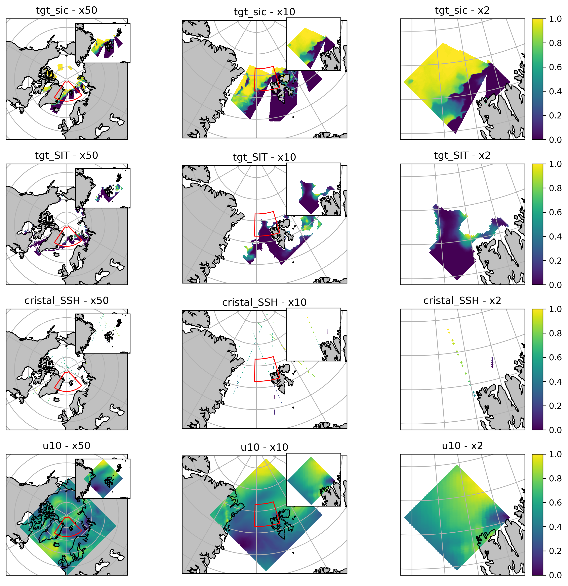

# 4DVarNet Multi-Resolution (CROSCIM)

## Prerequisites
- git  
- conda  

## Install
### Install project dependencies
```bash
git clone https://github.com/CIA-Oceanix/4dvarnet-starter.git
cd 4dvarnet-starter
conda install -c conda-forge mamba
conda create -n 4dvarnet-starter
conda activate 4dvarnet-starter
mamba env update -f environment.yaml
```

---

## Data preparation

The multiresolution training relies on **preprocessed NetCDF files** provided at different spatial resolutions (e.g. x2, x10, x50).  
You can preprocess the patches with `preprocessing_CROSCIM_multires.py`, then aggregate your batches into single NetCDFs using the provided script in:

```
contrib/CROSCIM/scripts/aggregate_preproc.sh
```

After preprocessing, you should obtain files like:
```
/dmidata/users/maxb/PREPROC/preproc_CROSCIM_x2.nc
/dmidata/users/maxb/PREPROC/preproc_CROSCIM_x10.nc
/dmidata/users/maxb/PREPROC/preproc_CROSCIM_x50.nc
```

These files are used directly by the datamodule (with preprocessing of the batches).

---

## Run

The model uses **Hydra** for configuration.  
You can run a multiresolution experiment with:

```bash
python main.py xp=CROSCIM/base_arctic_croscim_wpreproc.yaml
```

This will load the `BaseDataModuleMultiRes_simplify` datamodule and the `Lit4dVarNet_CROSCIM` model with multiple solvers (x2, x10, x50).

---

## Visualization

To visualize how the different resolutions nest into one another, you can run the plotting script:

```bash
python contrib/CROSCIM/plot_CROSCIM_multires.py
```

This produces the figure:


showing the variables of interest (`tgt_sic`, `cimr_SIT`, `cristal_SSH`, `u10`) arranged by **resolution** (columns) and **variable** (rows), with inset zooms between nested grids.

---

## Saved weights

(to be provided once training is complete)

---

## Useful links
- [Hydra documentation](https://hydra.cc/docs/intro/)  
- [PyTorch Lightning documentation](https://pytorch-lightning.readthedocs.io/en/stable/index.html#get-started)  
- 4DVarNet papers:
  - Fablet, R.; Amar, M. M.; Febvre, Q.; Beauchamp, M.; Chapron, B. *END-TO-END PHYSICS-INFORMED REPRESENTATION LEARNING FOR SATELLITE OCEAN REMOTE SENSING DATA: APPLICATIONS TO SATELLITE ALTIMETRY AND SEA SURFACE CURRENTS.* ISPRS Annals 2021. https://doi.org/10.5194/isprs-annals-v-3-2021-295-2021  
  - Fablet, R.; Chapron, B.; Drumetz, L.; Mmin, E.; Pannekoucke, O.; Rousseau, F. *Learning Variational Data Assimilation Models and Solvers.* JAMES 2021. https://doi.org/10.1029/2021MS002572  
  - Fablet, R.; Beauchamp, M.; Drumetz, L.; Rousseau, F. *Joint Interpolation and Representation Learning for Irregularly Sampled Satellite-Derived Geophysical Fields.* Frontiers in Applied Mathematics and Statistics 2021. https://doi.org/10.3389/fams.2021.655224 

